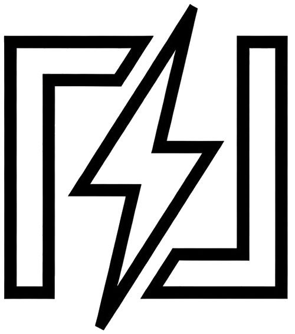
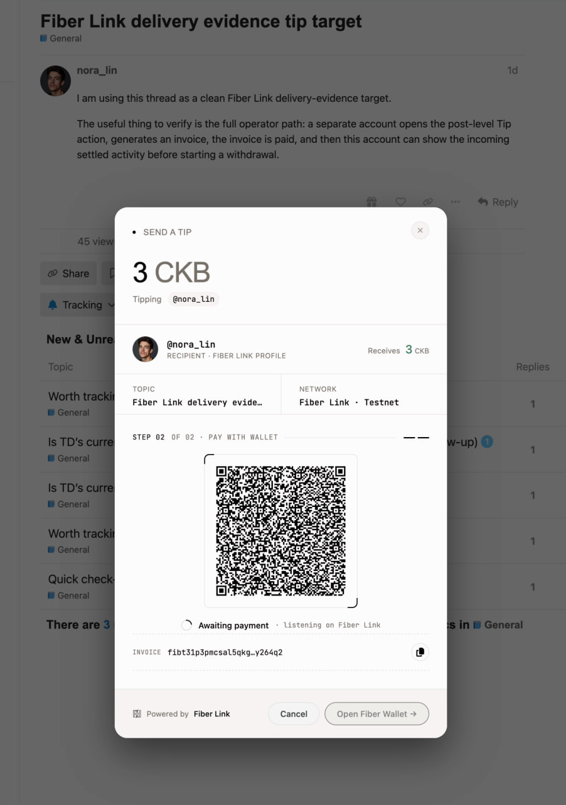

# Fiber Link

<p align="center">
  <a href="https://www.fiberlink.me">
    
  </a>
</p>

<h2 align="center">Community tipping over CKB Fiber, without making community members run nodes.</h2>

<p align="center">
  Fiber Link adds instant, low-fee tips and creator withdrawals to online communities, starting with Discourse.
</p>

<p align="center">
  <a href="https://www.fiberlink.me">Website</a> ·
  <a href="docs/getting-started.md">Getting Started</a> ·
  <a href="docs/current-status.md">Current Status</a> ·
  <a href="docs/README.md">Docs</a>
</p>

---

## What Is Fiber Link?

Fiber Link is an open-source payment layer for community tipping and small creator payouts. It lets a forum member tip a post or reply, lets the recipient see the payment in a creator dashboard, and lets the recipient withdraw later to a CKB address.

The product hides the hard parts of the CKB Fiber Network behind a community-operated service:

- community members use a familiar forum UI instead of running a Fiber node;
- payments settle through a hosted Fiber hub and service ledger;
- operators get admin controls, monitoring, limits, backup procedures, and deployment evidence;
- creators get a simple dashboard for received tips, balance, activity, and withdrawals.

Fiber Link currently targets Discourse communities first, but the service model is designed so other community products can integrate later.

---

## What You Can Do With Fiber Link

| Capability | What It Means For You |
|---|---|
| **Tip posts and replies** | Add a Tip action to Discourse content so readers can support useful contributions directly. |
| **Pay over Fiber** | Generate Fiber payment requests for tips and settle them through the backend service. |
| **Creator dashboard** | Give creators one place to see received tips, balance, recent activity, and withdrawal status. |
| **Withdraw to CKB** | Let creators request payouts to CKB testnet or mainnet addresses, with transaction evidence. |
| **Admin controls** | Configure allowed assets, withdrawal thresholds, limits, and app-scoped admin access. |
| **Operator runbooks** | Deploy, monitor, back up, recover, and verify the stack with documented procedures. |
| **Milestone evidence** | Keep acceptance checklists and demo evidence in the repository for transparent delivery. |

<p align="center">
  
</p>

<p align="center"><em>A Discourse member opens the Tip dialog, selects an amount, and pays through Fiber Link without leaving the community context.</em></p>

---

## Why Fiber Link?

Most community monetization tools are either too heavy for small payments or too far away from the community experience.

Fiber Link is built for a different shape:

- **Low-friction community UX.** Tipping happens inside the forum flow, not in a separate wallet product.
- **Small-payment friendly.** Fiber is designed for fast, low-fee payments where L1-only transfers feel too slow or too expensive.
- **Creator-readable dashboard.** Recipients see incoming activity, available balance, and withdrawals without reading node logs.
- **Operator-grade controls.** A hosted payment layer must have explicit limits, monitoring, backups, and recovery paths.
- **Auditable delivery.** Acceptance evidence, deployment notes, and runbooks live with the code instead of only in chat history.

---

## Who Is Fiber Link For?

- **Community operators** who want native tipping without sending users to a separate donation flow.
- **Creators and helpful forum members** who should be rewarded for valuable posts and replies.
- **CKB / Fiber builders** who need a concrete community payment integration example.
- **Discourse administrators** who want a plugin-first path with documented deployment and smoke tests.
- **Contributors** who want a real product surface for payment, ledger, withdrawal, and operator workflows.

---

## Current Status

Fiber Link has completed its current Milestone 1–3 acceptance checkpoints:

- Milestone 1: core payment and service foundation;
- Milestone 2: Discourse integration and settlement workflow;
- Milestone 3: withdrawals, admin controls, production hardening, and mainnet-readiness documentation.

The public demo and milestone evidence are maintained as acceptance artifacts. For the honest shipped/limited boundary, start with [Current Status](docs/current-status.md).

---

## Quick Start

### If you are evaluating the product

1. Read [Current Status](docs/current-status.md) to understand what is ready today.
2. Read [Getting Started](docs/getting-started.md) for the shortest path through the demo, local stack, and operator docs.
3. Review [Milestone Acceptance](docs/acceptance/README.md) for checkpoint-level evidence.

### If you are a Discourse administrator

Start with the plugin and deployment guides:

- [Discourse Plugin Admin Guide](docs/runbooks/discourse-plugin-admin.md)
- [Admin Installation Guide](docs/admin-installation.md)
- [Fiber Link Stack Deployment](docs/runbooks/fiber-link-stack-deployment.md)

### If you are a developer

The service lives in `fiber-link-service/` and the Discourse plugin lives in `fiber-link-discourse-plugin/`.

Common verification entry points:

```bash
# Service tests from the monorepo service workspace
cd fiber-link-service
bun run --filter @fiber-link/db test --run
bun run --filter @fiber-link/admin test --run
bun run --filter @fiber-link/rpc test --run
bun run --filter @fiber-link/worker test --run

# Discourse plugin smoke tests from the repository root
scripts/plugin-smoke.sh
```

Use the specific runbook for the workflow you are changing before relying on these commands alone.

---

## Documentation

| Document | What's Inside |
|---|---|
| [Getting Started](docs/getting-started.md) | First-time orientation for evaluators, operators, and developers. |
| [Current Status](docs/current-status.md) | What works today, operator surfaces, evidence, and honest boundaries. |
| [Docs Map](docs/README.md) | Full documentation index organized by audience and task. |
| [Milestone Acceptance](docs/acceptance/README.md) | Delivery checkpoints and acceptance evidence. |
| [Discourse Plugin Admin](docs/runbooks/discourse-plugin-admin.md) | Install, configure, and verify the forum plugin. |
| [Stack Deployment](docs/runbooks/fiber-link-stack-deployment.md) | Deploy the service, FNN nodes, database, worker, and monitoring surfaces. |
| [Mainnet Deployment Checklist](docs/runbooks/mainnet-deployment-checklist.md) | Mainnet-readiness preflight, rollback, and post-deploy checks. |

---

## Discourse Plugin Distribution

- Plugin source of truth in this monorepo: [`fiber-link-discourse-plugin/`](fiber-link-discourse-plugin/)
- Standalone install repository for Discourse admins: <https://github.com/Keith-CY/fiber-link-discourse-plugin>
- Sync automation: [`.github/workflows/sync-discourse-plugin-mirror.yml`](.github/workflows/sync-discourse-plugin-mirror.yml) mirrors the plugin subtree from this repo into the standalone plugin repo after the main CI workflow succeeds.

---

## Primary Reference

- Nervos Talk proposal: <https://talk.nervos.org/t/dis-fiber-link-a-ckb-fiber-based-pay-layer-tipping-micropayments-for-communities/9845>

---

## License

Fiber Link is released under the [MIT License](LICENSE).
