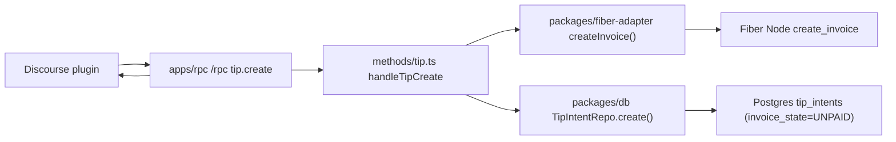
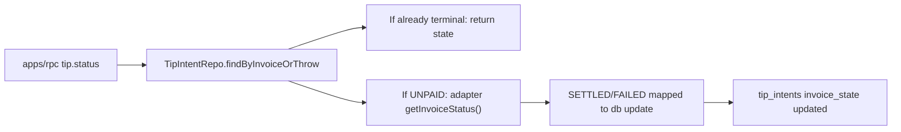
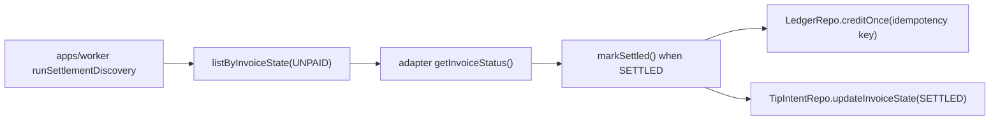
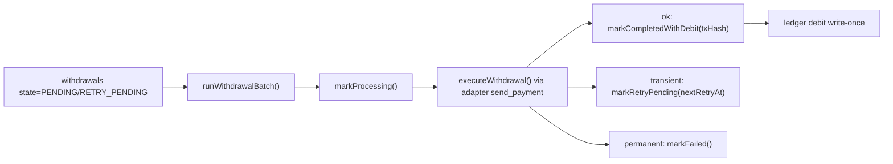

# Architecture Boundaries and Lifecycle Map

This document reflects the current code layout and runtime boundaries for the invoice -> payment -> settlement pipeline.

## Scope and assumptions

- MVP is hosted custodial: `apps/rpc` and `apps/worker` run in one trusted backend domain.
- Durable state is Postgres (tip intents, ledger, withdrawals, app credentials).
- Redis is used for nonce replay protection in the RPC auth boundary.
- Fiber Node (FNN) is an external dependency reached via JSON-RPC through `packages/fiber-adapter`.

## Module map (code-auditable)

| Boundary | Primary paths | Responsibilities | Key read/write side effects |
| --- | --- | --- | --- |
| Discourse integration boundary (external to this repo) | `plugins/fiber-link/*` (Discourse plugin repo) | Collect tip input, call backend RPC, show invoice and status to users | Calls `/rpc` in `apps/rpc` with signed headers |
| API boundary (`apps/rpc`) | `fiber-link-service/apps/rpc/src/rpc.ts` `fiber-link-service/apps/rpc/src/methods/tip.ts` | Verify HMAC + timestamp + nonce replay, validate JSON-RPC payloads, dispatch `tip.create` and `tip.status` | Creates tip intents, reads/updates invoice state, returns stable JSON-RPC errors |
| Worker boundary (`apps/worker`) | `fiber-link-service/apps/worker/src/entry.ts` `fiber-link-service/apps/worker/src/settlement-discovery.ts` `fiber-link-service/apps/worker/src/withdrawal-batch.ts` | Poll unpaid invoices, reconcile settlement state, execute withdrawal queue with retry policy | Writes tip settlement state, ledger credits/debits, withdrawal lifecycle transitions |
| Fiber adapter provider (`packages/fiber-adapter`) | `fiber-link-service/packages/fiber-adapter/src/provider.ts` `fiber-link-service/packages/fiber-adapter/src/rpc-adapter.ts` `fiber-link-service/packages/fiber-adapter/src/simulation-adapter.ts` | Selects adapter mode (`rpc` or deterministic `simulation`) and exposes a shared contract for invoice status + withdrawals | Enforces production guardrails for simulation mode and normalizes upstream response shapes to internal contracts (`InvoiceState`, `txHash`) |
| Persistence boundary (`packages/db`) | `fiber-link-service/packages/db/src/schema.ts` `fiber-link-service/packages/db/src/*-repo.ts` | Define schema + repos + transition guards for tip intents, ledger, withdrawals, app secrets | Enforces uniqueness (`invoice`, `idempotencyKey`) and transition checks |
| Deployment boundary (`deploy/compose`) | `deploy/compose/docker-compose.yml` `deploy/compose/.env.example` | Compose topology for postgres/redis/fnn/rpc/worker and runtime env wiring | Defines readiness/liveness probes and service dependency graph |

## Runtime trust boundaries

- Browser/client -> Discourse plugin UI:
  untrusted client boundary (XSS/CSRF/session risks).
- Discourse plugin -> `apps/rpc`:
  authenticated API boundary using `x-app-id`, `x-ts`, `x-nonce`, `x-signature`.
- `apps/rpc` + `apps/worker` -> FNN:
  external RPC boundary through `packages/fiber-adapter`.
- `apps/rpc` + `apps/worker` -> Postgres:
  durable state boundary for all financial side effects.
- `apps/rpc` -> Redis:
  anti-replay boundary for nonce uniqueness window.

## Lifecycle trace: invoice creation -> payment -> settlement

### A) Invoice creation path

Traceable code path:

1. `apps/rpc/src/rpc.ts`: validates auth and params for `tip.create`.
2. `apps/rpc/src/methods/tip.ts#handleTipCreate`: calls `createAdapter().createInvoice`.
3. `packages/fiber-adapter/src/index.ts#createInvoice`: sends `create_invoice`.
4. `packages/db/src/tip-intent-repo.ts#create`: persists `tip_intents` row (`invoice_state = UNPAID`).

### B) Invoice status and settlement reconciliation

Traceable code path:

1. `apps/rpc/src/methods/tip.ts#handleTipStatus` handles synchronous status checks.
2. `apps/worker/src/settlement-discovery.ts#runSettlementDiscovery` handles async reconciliation/backfill.
3. `apps/worker/src/settlement.ts#markSettled` enforces one credit per tip intent via `settlement:tip_intent:<id>`.
4. `packages/db/src/ledger-repo.ts#creditOnce` uses uniqueness on `ledger_entries.idempotency_key`.

### C) Withdrawal lifecycle path

Traceable code path:

1. `apps/worker/src/withdrawal-batch.ts#runWithdrawalBatch` orchestrates transitions and retry matrix.
2. `packages/db/src/withdrawal-repo.ts` enforces state transitions (`PENDING -> PROCESSING -> COMPLETED/RETRY_PENDING/FAILED`).
3. `packages/db/src/ledger-repo.ts#debitOnce` ensures debit idempotency with `withdrawal:debit:<withdrawalId>`.

## State and integrity invariants

- `tip_intents.invoice` is unique and serves as lookup key for status reconciliation.
- `ledger_entries.idempotency_key` is unique and blocks duplicate balance mutations.
- Amount invariants are enforced as strict positive decimals (`> 0`) across tip creation, ledger writes, and withdrawal creation paths.
- Withdrawal transitions are guarded by state-aware `WHERE` clauses; invalid transitions raise explicit conflict errors.
- Terminal withdrawal evidence includes `tx_hash` and `completed_at`.

## Deployment topology mapping

- `deploy/compose/docker-compose.yml` wires `postgres`, `redis`, `fnn`, `rpc`, `worker`.
- `rpc` depends on `postgres`, `redis`, `fnn`; `worker` depends on `postgres`, `rpc`.
- Health probes are codified:
  - RPC readiness: `apps/rpc/src/scripts/healthcheck-ready.ts`
  - Worker readiness: `apps/worker/src/scripts/healthcheck.ts`
- Runtime env contract is documented in `deploy/compose/.env.example`.
