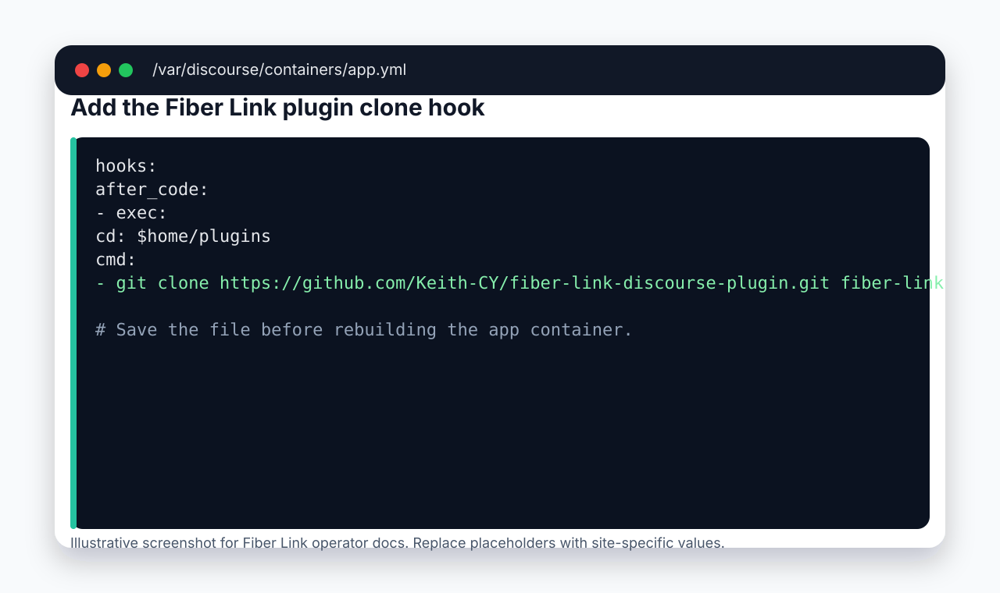
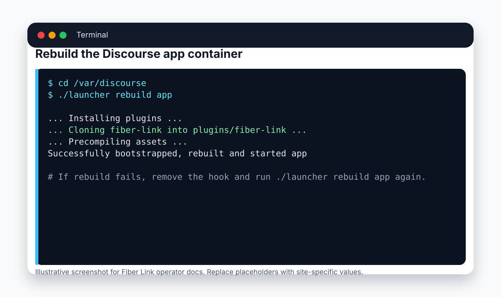
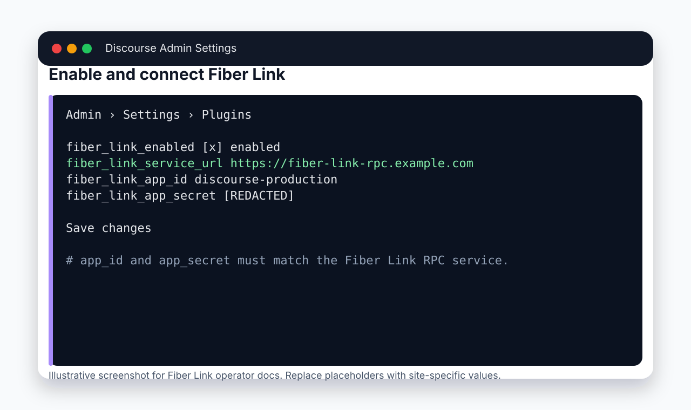
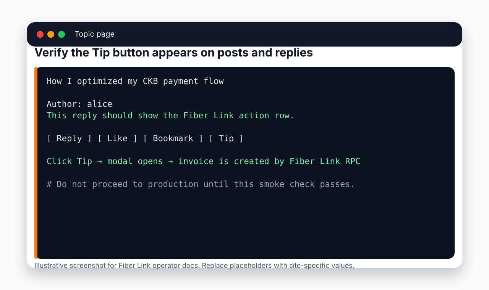

# Discourse Plugin Installation with Screenshots

This guide shows the operator-facing path for installing the Fiber Link Discourse plugin on a standard self-hosted Discourse Docker install.

> Screenshot note: the images below are documentation-safe illustrative screenshots. They intentionally use placeholders and `[REDACTED]` instead of real secrets or deployment-specific URLs.

## Prerequisites

- SSH/admin access to the Discourse host.
- A standard `/var/discourse` Docker install.
- Permission to edit `/var/discourse/containers/app.yml`.
- Fiber Link RPC service URL, app id, and app secret from your Fiber Link deployment.

## 1. Add the plugin to `app.yml`

Open `/var/discourse/containers/app.yml` and add the Fiber Link plugin clone command under `hooks.after_code`:



```yaml
hooks:
  after_code:
    - exec:
        cd: $home/plugins
        cmd:
          - git clone https://github.com/Keith-CY/fiber-link-discourse-plugin.git fiber-link
```

Keep the checkout directory as `fiber-link`; the plugin smoke tests and docs assume Discourse loads it from `plugins/fiber-link`.

## 2. Rebuild Discourse

Rebuild the app container so Discourse clones the plugin and compiles plugin assets:



```bash
cd /var/discourse
./launcher rebuild app
```

Expected result: the rebuild finishes successfully and the `app` container restarts. If the rebuild fails, remove the plugin hook, rebuild again to recover the site, then inspect the rebuild logs before retrying.

## 3. Enable and configure Fiber Link in Discourse Admin

After the rebuild, sign in as a Discourse admin and open:

```text
Admin > Settings > Plugins
```

Search for `fiber_link` and configure the plugin settings:



Required settings:

- `fiber_link_enabled`: enable the plugin.
- `fiber_link_service_url`: reachable Fiber Link RPC URL.
- `fiber_link_app_id`: app id configured for this Discourse instance.
- `fiber_link_app_secret`: shared secret matching Fiber Link RPC expectations.

Never paste production secrets into screenshots, tickets, or docs. Use `[REDACTED]` when sharing evidence.

## 4. Verify the Tip button on a topic

Open a topic or reply authored by another user. The post action row should include a Fiber Link `Tip` button:



Smoke check:

1. Open a topic as a logged-in user.
2. Confirm `Tip` appears next to post/reply actions.
3. Click `Tip`.
4. Confirm the Fiber Link tip modal opens.
5. Confirm invoice creation succeeds against the configured RPC service.

## 5. Troubleshooting quick checks

From the Discourse host:

```bash
cd /var/discourse
./launcher logs app
```

Check for:

- plugin clone failures under `$home/plugins/fiber-link`
- asset precompile errors
- missing or wrong `fiber_link_service_url`
- RPC auth failures caused by mismatched `fiber_link_app_id` / `fiber_link_app_secret`

## 6. Rollback

If the plugin breaks the Discourse rebuild or boot path:

1. Remove the Fiber Link clone command from `/var/discourse/containers/app.yml`.
2. Rebuild Discourse:

```bash
cd /var/discourse
./launcher rebuild app
```

3. Rotate `fiber_link_app_secret` if it was exposed during debugging.

## Related docs

- [Admin Installation Guide](admin-installation.md)
- [Fiber Link Discourse Plugin README](https://github.com/Keith-CY/fiber-link-discourse-plugin/blob/main/README.md)
